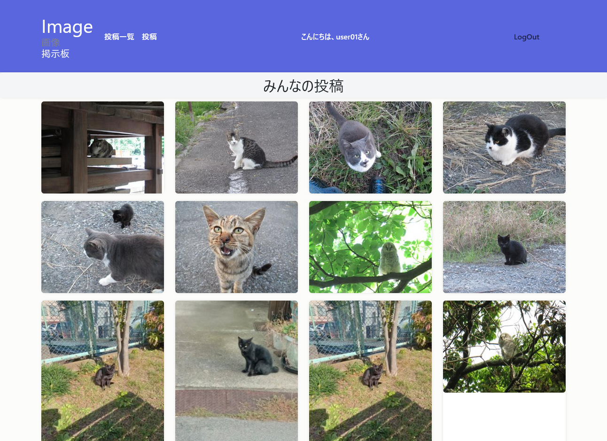
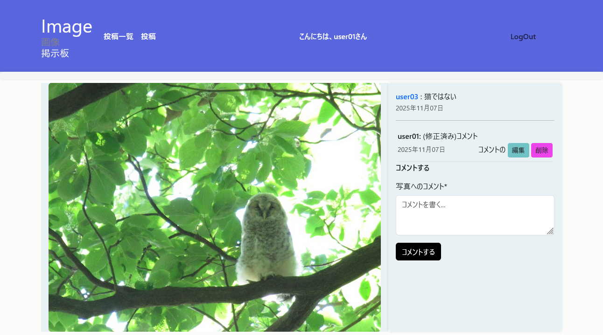

# 簡易画像掲示板

## 概要

このプロジェクトは、Django の学習目的で作成した Web アプリケーションです。

トップページは画像一覧が誰でも閲覧できます。

ログインすると画像が投稿でき、画像のリサイズ、サムネイルの作成を自動でおこないます。

画像詳細ではログイン状態で他のユーザーがコメントを投稿、編集、削除ができます。

## スクリーンショット

### トップページ（画像一覧）



### 詳細ページ



## データベースについて

  開発は PostgreSQL でおこないましたが、このリポジトリでは SQLite を使用しています。
  
  また、環境変数の管理に django-environ を導入しているので.envを設定していただければ PostgreSQL でも実行できるようになっています。
  
  .env.example を参考に .env を設定してください。そのままでしたら SQLiteで 実行できます。
  

## 導入方法

  
```bash  
git clone https://github.com/rotyo-ko/my_imageboard
# git がないときは zipファイルをダウンロードしてください。

cd my_imageboard

# .env の作成
# .env.example をコピーして .env を作成してください

# 仮想環境の作成
python -m venv venv
```

## 仮想環境の有効化
### Windows (コマンドプロンプト)
```bash
venv\Scripts\activate
```

### Windows PowerShell
```bash
.\venv\Scripts\Activate.ps1
```
### macOS / Linux (bash/zsh)
```bash
source venv/bin/activate
```

## パッケージのインストール
```bash
pip install -r requirements.txt
```
## SECRET_KEY の設定

Django を起動するには SECRET_KEY が必要です。

以下のコマンドを実行して、表示された文字列を .env のSECRET_KEY に設定してください。


```bash
python -c "from django.core.management.utils import get_random_secret_key; print(get_random_secret_key())" 
```

## マイグレーション と　サーバー起動
```bash
python manage.py migrate
python manage.py runserver
```
  
### ブラウザでアクセス
http://127.0.0.1:8000/
  
## テストの実行
ブラウザ、Web APIのテストがあります
```bash
python manage.py test
```
